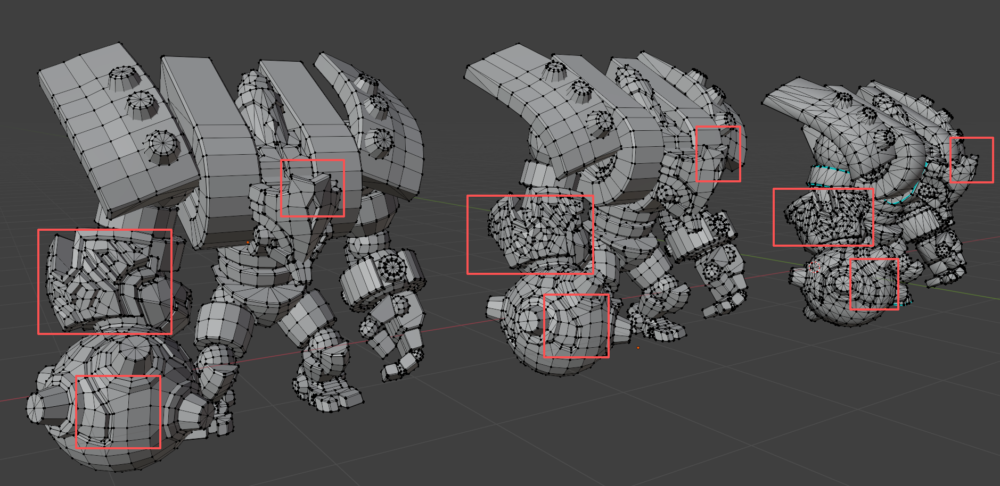
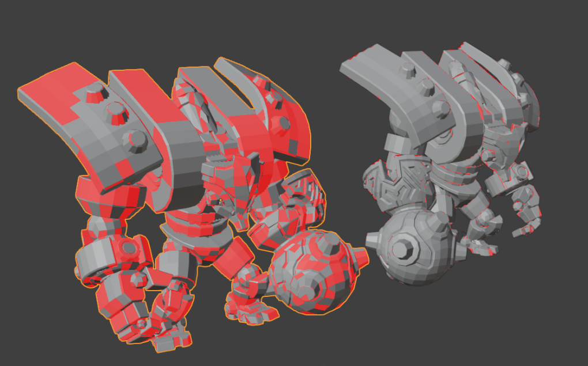
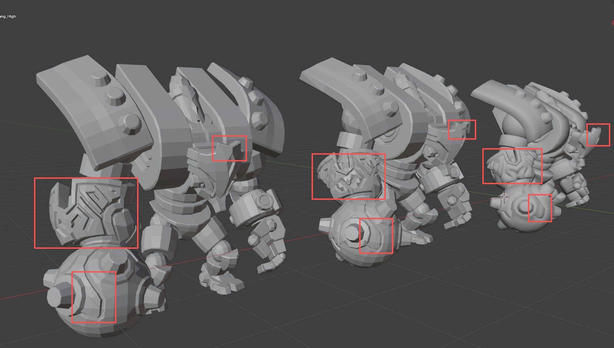
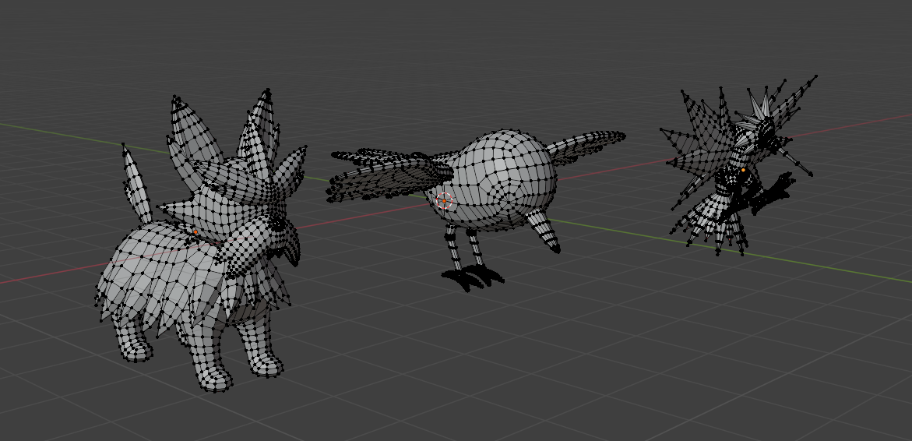
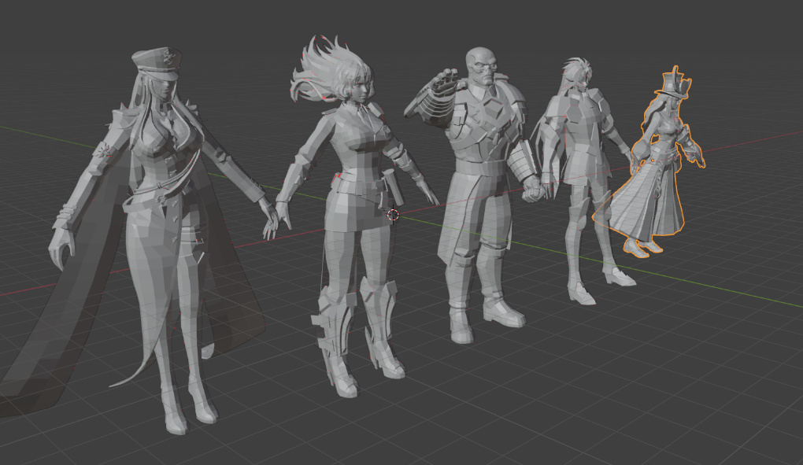

# Tri-to-Quad Operator
## 1. Introduction
We developed a high-performance Tri-to-Quad Operator and it reaches SOTA effect with rich geometric filter control and globally post-merge consistent normals. 

### TODO
- [x] Release Python API for researchers.
- [x] Release Technical details.
- [ ] Release Blender Addon for 3D artists. <br>
- [ ] Release Source Code.

<p align="center">
  
</p>
<p align="center">
  <em>Pic 1. <b>Quality Comparison</b>: Left: Self-developed operator; Middel: pymeshlab API;  Right: GT Tri Mesh
</em>
</p>

My operator indicates much higher topological & geometrical quality comparing to pymeshlab/blender build-in operator (e.g. meshing_tri_to_quad_dominant(level=2), 2:'Better quad shape').

<p align="center">
  
</p>
<p align="center">
  <em>Pic 2. <b>Normal Consistent</b>: Left: Other operators; Right: Self-developed operator<br>
  (Red faces indicate inward-pointing normals, while white faces indicate outward-pointing normals.)
</em>
</p>
My operator indicates globally normal consistent comparing to some other tools. 

## 2. Installation
```bash
conda create -n quad python=3.11 -y
conda activate quad 
pip install quad_converter-1.0.0-cp311-cp311-linux_x86_64.whl
```

## 3. Test

###  Instructions
```bash
# Test Python API
python -c "import quad_converter; print(quad_converter.__version__)"

# Test Command Line Tools, we provide high control of geometric attributes, check it here!
quad-convert --help

# Test conversion
# Basic Usage
quad-convert --input test.obj --output test_quad.obj --verbose

# Usage with parameter
quad-convert \
  --input model.obj \
  --output model_quad.obj \
  --angle_threshold 150 \
  --method blossom \
  --verbose

# test.py for tri-obj input and ouput quad-output
python test.py
```

###  Python API

```python
import quad_converter
import numpy as np

# Prepare Mesh Data
vertices = np.array([...], dtype=np.float64)  # (N, 3)
triangles = np.array([...], dtype=np.int32)   # (M, 3)

# Convert to quad dominant mesh
result = quad_converter.convert_tri_to_quad(
    vertices=vertices,
    triangles=triangles,
    angle_threshold_deg=150.0,
    matching_method="blossom"
)

# Results
new_vertices = result["new_vertices"]
quad_faces = result["quads"]
tri_faces = result["tris"]
stats = result["merge_stats"]

print(f"Generate {len(quad_faces)} quads")
print(f"Left {len(tri_faces)} tris")
```
## 4. More Results:

<p align="center">
  
</p>
<p align="center">
  <em>Pic 3. <b>Quality Comparison</b>: Left: Self-developed operator; Middel: pymeshlab API;  Right: GT Tri Mesh
</em>
</p>

<p align="center">
  
</p>
<p align="center">
  <em>Pic 4. More results from my operator to indicate <b>great topological & geometrical quality</b>.
</em>
</p>

<p align="center">
  
</p>
<p align="center">
  <em>Pic 5.  More results from my operator to indicate <b>globally normal consistent</b>.
</em>
</p>

## License
The license is based on the modified, 3-clause BSD-License.

An informal summary is: do whatever you want, but include this operator's license text within your product.
